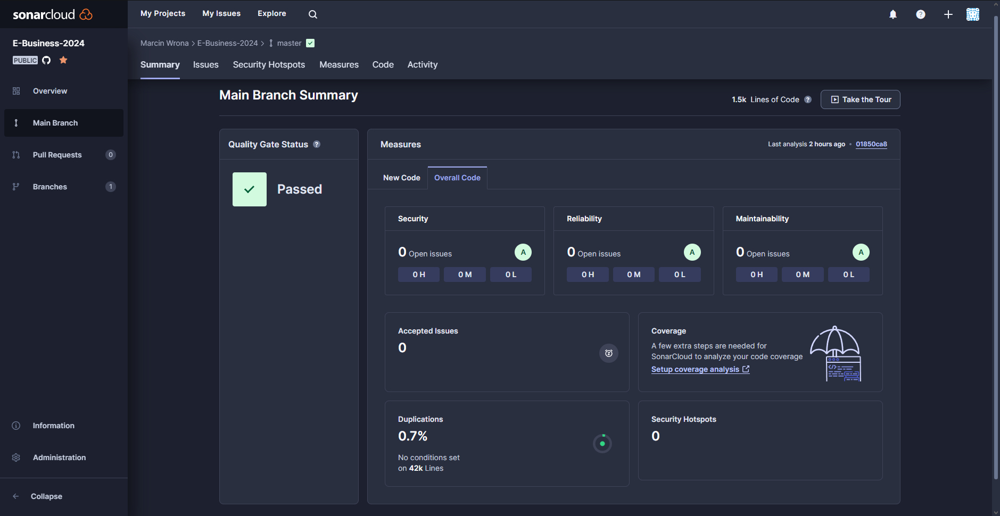

# Zadanie 7 Sonar

Należy dodać projekt aplikacji klienckiej oraz serwerowej (jeden branch, dwa repozytoria) do Sonara w wersji chmurowej (https://sonarcloud.io/). Należy poprawić aplikacje uzyskując 0 bugów, 0 zapaszków, 0 podatności, 0 błędów bezpieczeństwa. Dodatkowo należy dodać widżety sonarowe do README w repozytorium dane projektu z wynikami.

- Należy dodać litera do odpowiedniego kodu aplikacji serwerowej w hookach gita
- Należy wyeliminować wszystkie bugi w kodzie w Sonarze (kod aplikacji serwerowej)
- Należy wyeliminować wszystkie zapaszki w kodzie w Sonarze (kod aplikacji serwerowej)
- Należy wyeliminować wszystkie podatności oraz błędy bezpieczeństwa w kodzie w Sonarze (kod aplikacji serwerowej)
- Należy wyeliminować wszystkie błędy oraz zapaszki w kodzie aplikacji klienckiej

Sonara podpiąłem do całego repozytorium usuwając błędy z wszystkich poprzednich zadań. W szczególności podpiąłem lintera do zadania 4 (Go).

Screen z raportu:

